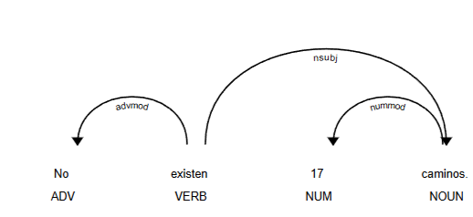

# Api de deteccion de Frases negativas complejas
## Definicion
Una *Complex Negative Phrase* (“frase negativa compleja”) es una oración en la que no basta con tener una sola negación, sino que esa negación se ve reforzada o propagada por la estructura sintáctica de la oración. En otras palabras:

1. Contiene **negación explícita** — por ejemplo: “no”, “nada”, “nadie”, “nunca”, “ninguno”, etc.  
2. Tiene una **estructura compleja** — puede incluir cláusulas subordinadas, modificadores, dependientes (objetos, adverbios, oraciones relativas, etc.).  
3. La negación **“viaja” o se hereda** a través de la estructura: los componentes dependientes de verbos o adjetivos también pueden contener o propagar negaciones (“refuerzos negativos”), de modo que la carga negativa se acumula en el análisis sintáctico.

## Ejemplos

### Frases que **sí** podrían considerarse *Complex Negative Phrases*

- “No creo que nadie haga nada para evitarlo.”  
  → “no” + “nadie” + “nada” y hay cláusula subordinada, propagación.  
- “No es imposible que no veas lo que ha sucedido.”  
  → “no” + “imposible” + “no” — varios niveles de negación en jerarquía de cláusulas.  
- “No hubo ninguno que no lo advirtiera primero.”  
  → “no” + “ninguno” + “no” en cláusula relativa.  
- “Nunca me ha dicho que no estaría dispuesto.”  
  → “nunca” + “no” en la subordinada.
  
### Frases que **no** serían *Complex Negative Phrases*

- “No quiero ir al cine.”  
  → Solo una negación directa; no estructura compleja.  
- “Nadie vino.”  
  → Sólo “nadie”, sin otras capas sintácticas de herencia de negación.  
- “Nunca estudia.”  
  → Sólo “nunca”, sin cláusulas subordinadas ni dependientes con más negaciones.

## Objetivo de la api
El objetivo de APIComplexNegativePhrase es detectar frases con negaciones dobles que se cancelan entre sí. Para lograrlo, analiza la estructura sintáctica de la oración y las relaciones de dependencia entre palabras, especialmente verbos y adjetivos. De esta forma puede diferenciar si la negación se anula, se refuerza, o si es una negación simple o inexistente. El resultado es True cuando se trata de una negación compleja y False en los demás casos.

## Estrategia empleada
1. Detección morfológica con Spacy:
	Buscar los tokens que tengan el atributo pos_ con el valor de verbo o adjetivo.
2. Detección token negativo con diccionario de palabras negativas:
	Verificamos que el token obtenido en el paso 1 sea un token negativo para aumentar el contador de negativas,  en cualquier caso ya sea que el token sea o no un adjetivo negativo se continúa al paso 3.
3. Detección de dependencia sintáctica del token:
  Verificamos si los tokens obtenidos en el paso 1 poseen hijos con el atributo dep_ con alguno de los siguientes valores: "ccomp", "acl","csubj","advmod","nsubj",”mark”,”obj”.
  Según estos valores tengo 2 opciones, si tenemos “advmod” vamos al paso 4 pero si son  "ccomp", "acl","csubj","nsubj" vamos al paso 2 con el token hijo y repetimos hasta obtener la doble negación o que no haya más hijos y por lo tanto la frase no posee una doble negación.
  También tenemos un caso especial en el que si entre los hijos tenemos uno con pos “sconj” (conjunción subordinada) entonces podemos tener un refuerzo de negación en lugar de cancelación y de la misma forma ocurre con una dependencia “det” con carga negativa.
4. Comparación con diccionario de palabras negativas:
  Se verifica si el token cuya dep_ es “advmod” existe en la lista de palabras negativas y si ya con este es la segunda negativa que se encuentra sabemos que la frase posee una doble negación pero si no se ha conseguido aún se continúa desde el siguiente hijo del padre en el paso 3.

## Ejemplos guiados
Para las siguientes figuras el análisis explicado en forma resumida es: Encontrar el primer verbo o adjetivo para analizar (puede ser el núcleo de la frase o una oración subordinada), moverse a través de sus hijos y buscar las negaciones, dudas, imposibilidades en estos tokens, a continuación observaremos casos interesantes que surgieron de estos análisis:
Nota: usaremos ASL para referirnos al Árbol sintáctico de dependencias.

**Figura 1. ASL de “nadie dijo nada”**  

En la Figura 1. tenemos otro caso en el que reforzamos la negativa en lugar de que estas se cancelen, “nada” como recibe la acción del verbo principal es su objeto directo (obj) según la relación de dependencias y la podemos usar para ignorar casos similares donde en lugar de caer en doble negación terminamos en negación reforzada.

**Figura 2. ASL de “no existe ningun camino”**  

En la Figura 2. tenemos otro caso distinto al de la Figura 2 de refuerzo y esto por el propio léxico tenemos que decir solamente “existe ningún camino” no es lo normal, se ocupa una negación antes del verbo principal y esto podemos diferenciarlo de otros casos por la dependencia que posee el hijo de “camino”, el determinante tiene una carga negativa (en este ejemplo) que actúa sobre el sustantivo “camino” pero no sobre el verbo principal “existe”, como resultado se acumula la negación del verbo + negación del sustantivo y es el motivo por el cual ignorar los tokens cuyos hijos poseen determinantes (al menos negativos) es una aproximación aceptable para diferenciar este caso de otros como por ejemplo la Figura 3. donde tenemos una negación simple a que existan 17 caminos, este número tiene una dependencia de nummod por lo tanto es negado en lugar de reforzar por no tener determinante negativo, lo mismo ocurre si usamos determinantes positivos  o neutros.

**Figura 3. ASL de “no existen 17 caminos”** 

Finalmente dejamos este espacio y la última figura para un caso de doble negación. 
La primera negación encontrada proviene del adjetivo “imposible”, considerado aquí porque semánticamente representa la negación de "posible", como se muestra en la Figura 4, donde esta misma negación es negada por un token hijo que tiene la dependencia de modificador adverbial (advmod).

**Figura 4. ASL de “no es imposible que venga”** 

