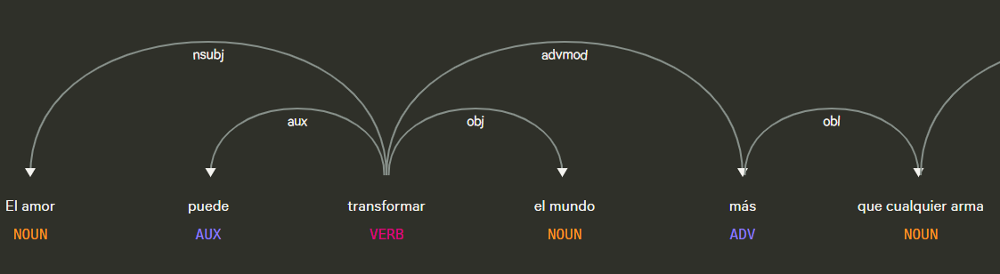

# Api de deteccion palabras abstractas
## Definicion
Una “abstract word” (en inglés) —o palabra abstracta— es un término lingüístico que hace referencia a conceptos que no son tangibles, es decir, que no se perciben directamente con los sentidos. A diferencia de palabras concretas (“mesa”, “perro”, “rojo”) que designan objetos, acciones o propiedades que podemos ver, tocar, oír, oler o saborear, una palabra abstracta se refiere a ideas, sentimientos, valores, cualidades, procesos mentales o estados que no tienen una forma física inmediata.

## Ejemplos
- *amor*  
- *libertad*  
- *justicia*  
- *verdad*  
- *felicidad*  
- *coraje*  
- *ira*  
- *conocimiento*  
- *lealtad*  
- *paz*  

## Objetivo de la api
El objetivo de ApiAbstractWords consiste en procesar un texto en español para identificar términos abstractos presentes en sustantivos, adjetivos y verbos. Combina reglas morfológicas, que detectan palabras con sufijos asociados a la abstracción, con un análisis de similitud semántica basado en vectores de palabras. Devuelve una lista de términos abstractos encontrados en el texto de entrada.

## Estrategia
Procesa un texto en español y detecta palabras abstractas (sustantivos, adjetivos y verbos) utilizando reglas morfológicas (prefijos y sufijos) y similitud semántica basada en lemas. Por ejemplo compara cada palabra del texto con un conjunto de **referencias abstractas** (como *amor*, *justicia*, *belleza*, etc.) y analiza su **similitud semántica**.  
Además, detecta posibles palabras abstractas por **prefijos** (`in-`, `im-`, `i-`, `des-`).

## Ejemplos guiados

**Figura 1.  “La amistad y la libertad son esenciales para la felicidad.”**  

En la figura 1:
- “amistad”, “libertad” y “felicidad” están en la lista de referencia de palabras abstractas.

- “esenciales” se detecta como adjetivo semánticamente cercano a “importante”, “bello”, “virtud”, etc., por lo tanto también se marca como abstracta.

**Figura 2. Una parte del diagrama de la frase “El amor puede transformar el mundo más que cualquier arma o palabra.”**  

En la figura 2:
- “amor” es claramente una palabra abstracta.

- “transformar” se considera abstracta porque refiere a una acción mental o de cambio, no física.

- “mundo”, “arma”, “palabra” son concretas, por lo que se excluyen.

