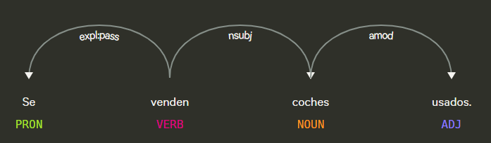
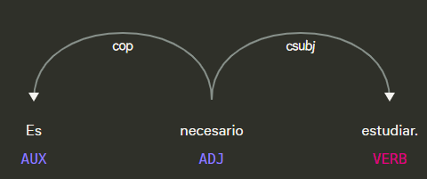
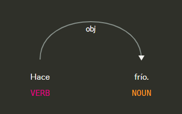

# Api de deteccion de oraciones impersonales

## Definicion
Las impersonal sentences (oraciones impersonales) son aquellas en las que no hay un sujeto explícito que realice la acción o donde el sujeto es indefinido. Es decir, no podemos decir “quién” hace la acción, porque se expresa de manera general o abstracta.

## Características principales

1. No hay sujeto explícito: la acción ocurre sin identificar quién la realiza.

2. Se centra en la acción, el estado o el fenómeno, no en la persona que lo hace.

3. Se usa mucho para generalizaciones, fenómenos naturales, instrucciones o expresiones impersonales.

## Tipos de oraciones impersonales

1. **Con “se” impersonal**  
   - Ejemplo: “Se vive bien en esta ciudad.”  
     → No se especifica quién vive; es general.

2. **Con verbos meteorológicos o fenómenos naturales**  
   - Ejemplo: “Llueve mucho en otoño.”  
     → No hay sujeto que haga llover; se describe un fenómeno.

3. **Con verbos en tercera persona sin sujeto concreto**  
   - Ejemplo: “Hace frío.”  
     → La oración describe un estado, no una acción de alguien.

4. **Con “uno” o personas en sentido general**  
   - Ejemplo: “Uno no sabe lo que tiene hasta que lo pierde.”  
     → El sujeto es general, indefinido.

# Ejemplos

| Oración | Tipo |
|---------|------|
| “Se dice que el libro es interesante.” | Con “se” impersonal |
| “Llueve todos los días.” | Verbo meteorológico |
| “Hace calor en verano.” | Tercera persona sin sujeto |
| “No se puede entrar sin permiso.” | Con “se” impersonal + obligación |

## Objetivo de la api
El objetivo de ApiImpersonalSentences consiste en determinar si una oración en español es impersonal, es decir, si carece de sujeto agente o no se refiere a una persona concreta. Analiza construcciones con se impersonal, verbos meteorológicos y formas verbales sin sujeto explícito. Devuelve True si la oración es impersonal, o False en caso contrario.

## Estrategia

El detector de oraciones impersonales se basa en análisis sintáctico y morfológico utilizando spaCy. La idea principal es identificar frases donde no existe un sujeto explícito o el verbo se comporta de forma impersonal según reglas lingüísticas.

1. Patrones y reglas heurísticas

    1. Verbo “haber” en forma de existencia (hay)

        - Ejemplo: “Hay muchas personas en la plaza.”

        - Todas las construcciones con hay se consideran impersonales.

    2. Construcciones con “se” impersonal

        - Se busca el pronombre “se” ligado al verbo principal.

        - Si hay un sujeto nominal (nsubj) pero sin agente explícito (por ejemplo introducido por “por”), se marca como impersonal/pasiva refleja.

        - Si hay objeto directo, se descarta como impersonal (probablemente reflexiva o transitiva).

        - Ejemplo impersonal: “Se venden coches usados.”

        - Ejemplo no impersonal: “Se comió la manzana.”

    3. “ser” + predicado adjetival

        - Si el verbo es “ser” y su predicado es un adjetivo, y no existe sujeto explícito en la cláusula, se marca como impersonal.

        - Ejemplo: “Es necesario estudiar.”

    4. Verbo “hacer” impersonal
        - Si “hacer” no tiene sujeto explícito y no forma parte de un patrón temporal (días, meses, años, horas…), se considera impersonal.

        - Ejemplo: “Hace frío.”

    5. Verbos finitos en 3.ª persona sin sujeto explícito

        - Cualquier verbo en tercera persona sin sujeto en su cláusula puede marcar la oración como impersonal.

        - También se aplica si el verbo es raíz (ROOT) y no se puede identificar persona explícita.

## Ejemplos visuales

**Figura 1.  “Se venden coches usados.”** 

Figura 1 es una impersonal sentece porque tiene la construcción con ‘se’ + nsubj sin agente explícito

**Figura 2.  “Es necesario estudiar.”** 

Figura 2 es una impersonal sentece porque tiene ‘ser’ + adjetivo sin sujeto explícito

**Figura 3.  “Hace frío.”** 

Figura 3 es una impersonal sentece porque tiene el verbo ‘hacer’ sin sujeto explícito y no patrón temporal