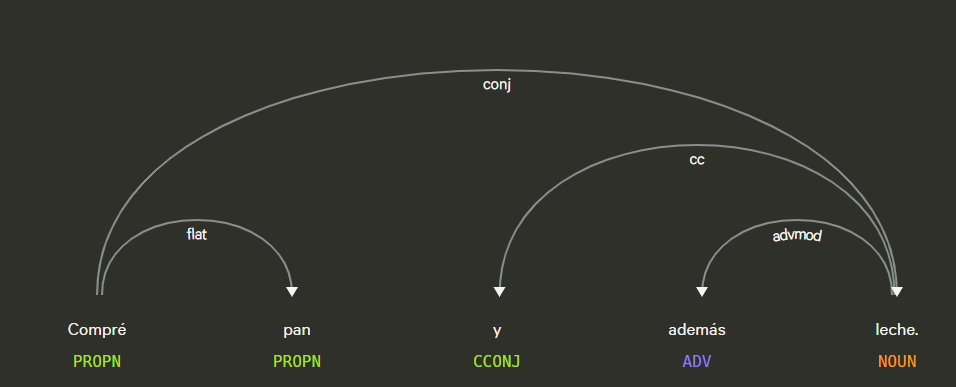
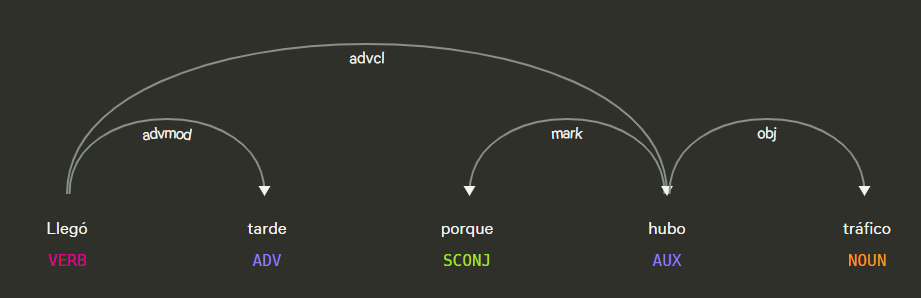

# Api de deteccion de de conectores logicos

## Definicion

Los conectores lógicos son palabras o expresiones que se utilizan para unir ideas, oraciones o párrafos, estableciendo relaciones de causa, consecuencia, contraste, adición, condición, secuencia, entre otros. Son esenciales para que un texto sea coherente y comprensible, ya que indican cómo se relacionan los distintos elementos del discurso.

## Características principales

1. Marcan relaciones entre ideas o proposiciones.

2. Mejoran la cohesión del texto, haciendo más clara la conexión entre oraciones.

3. Pueden ser de diferentes tipos, según la relación que expresan.

## Tipos de conectores lógicos

| Tipo | Conectores | Ejemplo |
|------|------------|---------|
| **Adición / Suma** | y, además, también, asimismo, incluso | “Estudió toda la noche y además hizo los ejercicios prácticos.” |
| **Contraste / Oposición** | pero, sin embargo, aunque, en cambio, no obstante | “Quería salir, pero empezó a llover.” |
| **Causa / Motivo** | porque, dado que, ya que, puesto que | “No vino a clase porque estaba enfermo.” |
| **Consecuencia / Resultado** | por lo tanto, por consiguiente, así que, entonces | “No estudió; por lo tanto, suspendió el examen.” |
| **Condición** | si, siempre que, a menos que | “Iremos al parque si no llueve.” |
| **Tiempo / Secuencia** | luego, después, antes, mientras, cuando | “Primero hizo la tarea, luego salió a jugar.” |
| **Ejemplificación / Aclaración** | por ejemplo, es decir, en otras palabras | “Hay frutas cítricas, por ejemplo, la naranja y el limón.” |
| **Resumen / Conclusión** | en resumen, en conclusión, finalmente | “En conclusión, debemos cuidar el medio ambiente.” |

## Ejemplos en oraciones

- **Adición:** “Compré pan y además leche.”  
- **Contraste:** “Quería ir al cine, pero estaba cerrado.”  
- **Causa:** “Llegó tarde porque hubo tráfico.”  
- **Consecuencia:** “No estudió, así que no aprobó.”  
- **Condición:** “Si llueve, no saldremos.”  
- **Tiempo:** “Antes de dormir, leo un libro.”  
- **Ejemplificación:** “Los colores cálidos, como el rojo y el naranja, llaman la atención.”  
- **Conclusión:** “En resumen, todo salió bien.”

## Objetivo de la api
El objetivo del servicio  ApiLogicalConnectors consiste en detectar conectores logicos en un texto en español utilizando spaCy y PhraseMatcher. Busca coincidencias exactas en una lista predefinida de conectores, lo que permite identificar correctamente tanto conectores simples como compuestos. Devuelve una lista con los conectores encontrados.

## Estrategia

1. Se crean patrones: Cada conector se convierte en un documento spaCy (nlp.make_doc(conector)) y se agrega al PhraseMatcher.

2. Se procesa el texto: El texto ingresado se analiza con spaCy para generar un objeto doc.

3. Se buscan coincidencias: PhraseMatcher recorre el doc y encuentra todas las coincidencias exactas de los conectores.

4. Resultados: Se extraen los tokens correspondientes a cada coincidencia y se devuelve una lista de conectores encontrados.

## Ejemplos Visuales

**Figura 1.  “Compré pan y además leche.”** 

Figura 1 tiene un conector de adiccion, "y".

**Figura 2.  “Llegó tarde porque hubo tráfico.”** 

Figura 2 tiene un conector de causa, "porque".