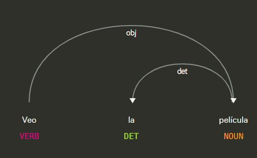

# Api de deteccion de verbos de opinicion y percepcion

## Definicion verbos de opinion
Los opinion verbs son verbos que expresan juicios, creencias o evaluaciones subjetivas sobre algo. Indican lo que alguien piensa, cree o considera. Son importantes en el análisis de texto porque muestran la actitud o postura del hablante o escritor.

### Características:

- Expresan opinión, juicio o valoración.

- Suelen ir acompañados de un objeto o cláusula que refleja lo opinado.

- Son subjetivos, no describen hechos objetivos.

### Ejemplos
| Verbo | Ejemplo |
|-------|---------|
| pensar | “Pienso que esta película es excelente.” |
| creer | “Creo que deberíamos estudiar más.” |
| opinar | “Opino que esta decisión es correcta.” |
| considerar | “Considero injusto el castigo.” |
| estimar | “Estimo que llegarán tarde.” |

## Definicion verbos de precepcion

Los perception verbs son verbos que indican percepción sensorial o cognitiva: lo que alguien ve, oye, siente, percibe o nota. Permiten identificar en el texto lo que es observado o experimentado.

### Características:

- Describen sensaciones, percepciones o experiencias.

- Suelen ir acompañados de objetos que son percibidos.

- Relacionados con los sentidos físicos (vista, oído, tacto, gusto, olfato) o cognitivos (notar, darse cuenta).

### Ejemplos

| Verbo | Ejemplo |
|-------|---------|
| ver | “Veo que la situación está complicada.” |
| oír | “Oí un ruido extraño en la noche.” |
| sentir | “Siento frío en la habitación.” |
| notar | “Noté que él estaba preocupado.” |
| observar | “Observé que las flores habían crecido.” |

## Objetivo de la api
El servicio de ApiOpinionPerceptionVerbs consiste en recibir una oración y detectar los verbos de opinión y/o percepción presentes. Devuelve un arreglo con cada verbo encontrado, su tipo (opinión, percepción), y el lema correspondiente.

## Estrategia

Se combina atrones sintácticos (usando Matcher de spaCy) y listas de palabras para identificar verbos que expresan opiniones o percepciones en un texto en español.

Opinion Verbs

- Patrón: [VERBO] + "que"

- Ejemplo: “Pienso que es importante…”

- Explica situaciones donde un verbo de opinión introduce una cláusula subordinada con “que”.

Perception Verbs

- Patrón: [VERBO] + [DET?] + [NOUN]

- Ejemplo: “Veo la película” o “Siento dolor”

- Captura verbos que se combinan con un sustantivo, opcionalmente con determinante.

Listas de palabras (palabras clave)

- Se usan como respaldo para detectar verbos que pueden no coincidir con los patrones sintácticos.

- Se tiene un conjunto de verbos que expresan creencias, juicios o emociones (ej. creer, opinar, sentir).
- Se tiene un conjunto de verbos que indican percepción sensorial o cognitiva (ej. ver, notar, escuchar).

## Ejemplos visuales

**Figura 1.  “Veo la película.”** 

Figura 1 tiene un verbo de precepcion

**Figura 2.  “Pienso que es importante estudiar.”** 

Figura 2 tiene un verbo de opinion