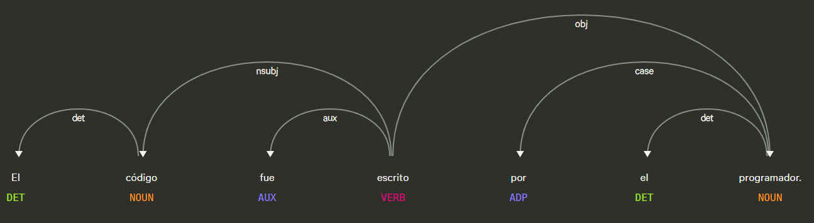
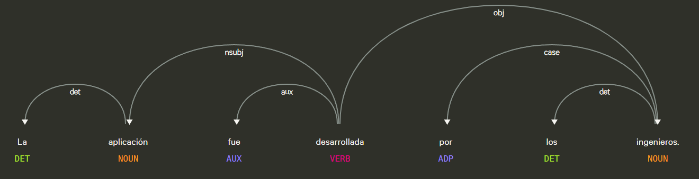

# Api de deteccion de conversion de voz pasiva a activa

## Definicion

La voz pasiva es una estructura gramatical utilizada para resaltar la acción y el objeto que la recibe, en lugar de quien la realiza.
En una oración pasiva, el sujeto no ejecuta la acción, sino que la recibe.

## Estructura
La voz pasiva se forma con el verbo “ser” + participio pasado, y opcionalmente se añade un complemento con “por” que indica quién realiza la acción.
El informe fue redactado por Ana:

- “fue” → forma del verbo ser

- “redactado” → participio del verbo redactar

- “por Ana” → complemento agente (quien realiza la acción)

## Ejemplo

| **Voz activa** | **Voz pasiva** |
|----------------|----------------|
| El programador escribió el código. | El código fue escrito por el programador. |
| María diseñó la base de datos. | La base de datos fue diseñada por María. |
| Los ingenieros desarrollaron la aplicación. | La aplicación fue desarrollada por los ingenieros. |

## Objetivo de la api
El servicio ApiPassiveVoice recibe una oración en español y analiza su estructura gramatical para identificar si está escrita en voz pasiva. Para ello examina la presencia de construcciones típicas de la voz pasiva, como el uso del verbo ser + participio, o expresiones pasivas con se. La oración no se modifica durante el análisis. Devuelve True cuando la oración es pasiva y False en cualquier otro caso.

## Estrategia
La api buscara los **componentes característicos de la voz pasiva:**

1. **Verbo principal en participio:**  
   Verifica que el verbo tenga la forma `VerbForm=Part` (por ejemplo: *escrito*, *hecho*, *diseñado*).

2. **Verbo auxiliar (“ser” o “estar”):**  
   Busca un auxiliar en tiempo pasado que acompañe al participio (por ejemplo: *fue*, *fueron*, *ha sido*).

3. **Sujeto paciente (`nsubj`):**  
   Identifica quién recibe la acción, es decir, el elemento gramatical con dependencia sintáctica `nsubj`.

4. **Complemento agente introducido por “por”:**  
   Busca la preposición **“por”** (`case`) y su sustantivo asociado, que indica quién realizó la acción (por ejemplo: *por el programador*).

## Ejemplos Visuales

**Figura 1.  “El código fue escrito por el programador.”** 

Figura 1 se puede ver que tiene una frase en voz pasiva que cumple con la estructura:

- “fue” → forma del verbo ser

- “escrito” → participio del verbo escribir

- “por el programador” → complemento agente (quien realiza la acción)

**Figura 2.  “La aplicación fue desarrollada por los ingenieros.”**
Figura 2 se puede ver que tiene una frase en voz pasiva que cumple con la estructura:

- “fue” → forma del verbo ser

- desarrollada → participio del verbo desarollar

- “por los ingenieros” → complemento agente (quienes realizan la acción) 