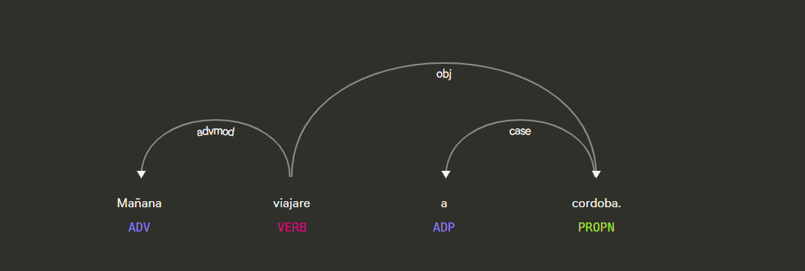

# Api de deteccion de tiempos verbales 

## Definicion

Un tiempo verbal es una categoría gramatical que indica cuándo ocurre una acción con respecto al momento del habla (presente, pasado o futuro).
En español, los tiempos verbales pueden ser simples (formados por una sola palabra, como “canto”, “canté”, “cantaré”) o compuestos (formados por un verbo auxiliar más un participio, como “he cantado”, “había comido”).
Además, existen perífrasis verbales, combinaciones de varios verbos que expresan matices temporales o aspectuales (por ejemplo, “voy a estudiar”, “está leyendo”).

El análisis de tiempos verbales es fundamental en el procesamiento del lenguaje natural (PLN), ya que permite comprender la cronología, la intención y la estructura sintáctica de un texto.

## Objetivo de la api

El objetivo de ApiTenses consiste en detectar y clasificar automáticamente los tiempos verbales presentes en un texto en español, utilizando el modelo lingüístico de spaCy.
La API analiza la estructura morfosintáctica de las oraciones y devuelve una lista de verbos junto con su tiempo verbal correspondiente, diferenciando entre tiempos simples, compuestos y perífrasis verbales.

## Ejemplo guiado 

## Estrategia

1. **Entrada:** 
 Una cadena de texto en español (una oración o párrafo) que se desea analizar.

2. **Procesamiento: Análisis lingüístico:**
Se procesa el texto con el modelo es_core_news_sm de spaCy, obteniendo información de etiquetas morfológicas y dependencias gramaticales.

3. **Identificación de verbos:**
Se extraen todos los tokens con categoría verbal (VERB, AUX).

4. **Clasificación del tiempo verbal:**

     . Tiempos simples: Presente, pasado, futuro.

     . Tiempos compuestos: Pretérito perfecto compuesto, pluscuamperfecto, futuro compuesto.

     . Perífrasis verbales: Futuro perifrástico (“voy a estudiar”), presente progresivo (“está leyendo”), y otras combinaciones frecuentes.
 Se detectan incluso perífrasis discontínuas, donde puede haber adverbios intercalados (“voy rápidamente a preparar”).

5. **Filtrado:**
 Se eliminan duplicados y auxiliares sueltos para evitar falsos positivos.

6. **Salida estructurada:**
  Devuelve una lista de tuplas donde cada elemento contiene:

  .El verbo o perífrasis detectada.

  .El tiempo verbal correspondiente.

## Ventajas 

1. Detecta tiempos verbales simples, compuestos y perifrásticos.

2. Soporta perífrasis discontinuas.

3. Devuelve resultados estructurados y fáciles de procesar.